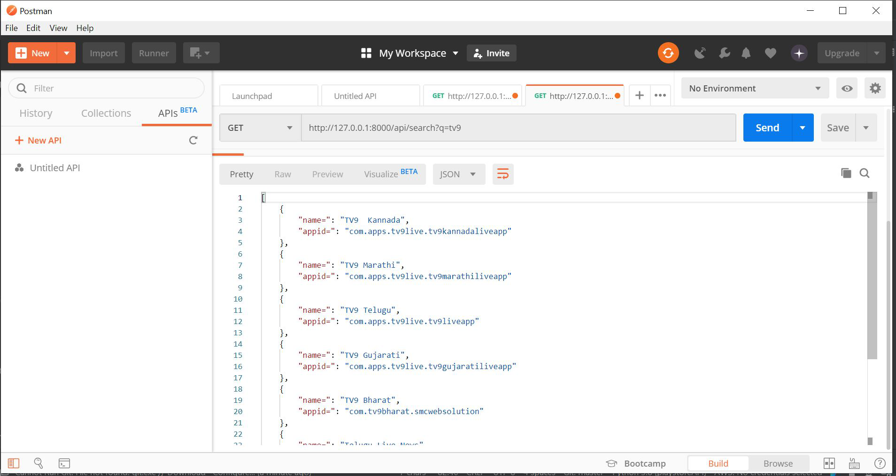
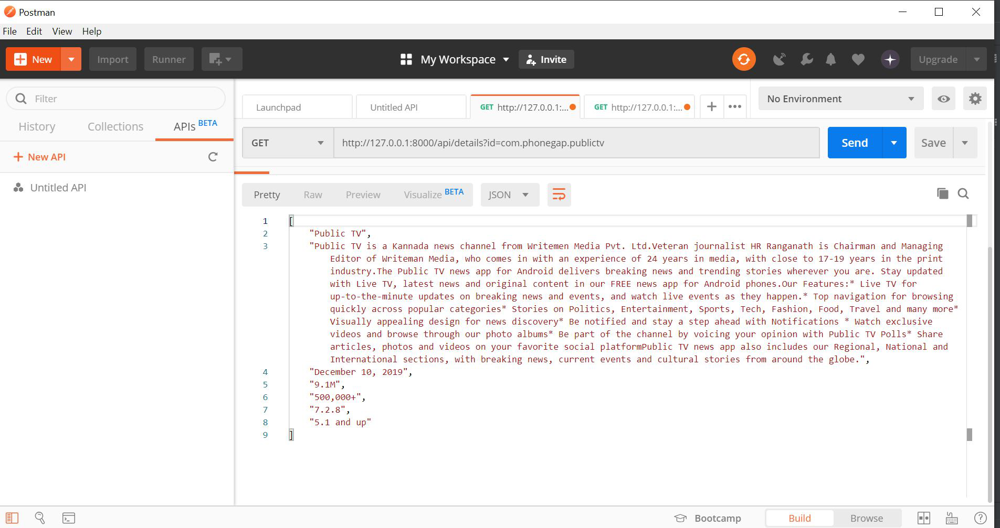

# playstoreAPI
 simple rest api proxy for google play store using django and restful api
  
 
 
 # for app search  
 http://127.0.0.1:8000/api/search?q=
 
# for app details  

http://127.0.0.1:8000/api/details?id=
 
# app search  

 

# app details first time Request  

 
# app details second time Request  

 
